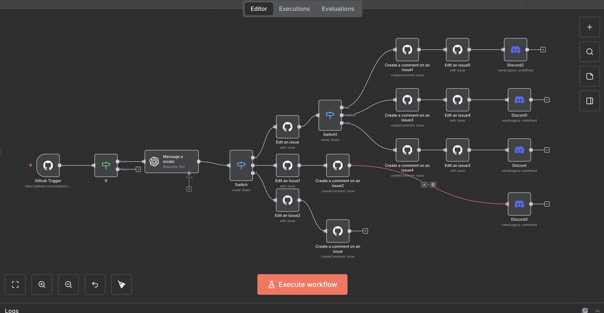

# 🤖 Intelligent GitHub Issue Triage Bot

This project is a sophisticated, automated workflow built in **N8N** that intelligently triages new GitHub issues. It uses **OpenAI (GPT)** to analyze issue content, categorizes it, assigns priority, and then performs automated actions like adding labels, posting comments, and alerting the team on Discord.

This workflow is designed to save developer time, reduce manual triage, and ensure that critical issues are flagged immediately.

---

## Workflow Diagram

Here is a high-level overview of the entire automation flow:

*(This image `workflow_diagram.png` should be a screenshot of your N8N canvas, added to the root of this repository).*

---

## 🚀 How It Works

The workflow is triggered by a GitHub webhook and follows this logic:

1.  **Trigger (Listen):** A **GitHub Trigger** node listens for any activity on the repository's issues.
2.  **Filter (Protect):** An **IF Node** acts as a "guard" to prevent infinite loops. It checks the `action` payload and only allows the workflow to continue if the action is `opened`. (This stops the workflow from triggering itself when it adds a label or comment).
3.  **Analyze (Think):** The issue's title and body are sent to an **OpenAI (GPT)** node with a custom system prompt. The AI is instructed to return a structured JSON object with two keys: `category` and `priority`.
4.  **Decide (Route):**
    * A **Switch Node** routes the flow based on the AI's `category` (`bug`, `feature_request`, `question`).
    * Nested **Switch Nodes** (e.g., under `bug`) then route the flow based on the `priority` (`high`, `medium`, `low`).
5.  **Act (Execute):** Based on the route, the workflow performs a series of actions using the **GitHub Node**:
    * **Add Labels:** Automatically adds appropriate labels like `critical-bug`, `bug`, `feature_request`, or `question` to the issue.
    * **Post Comment:** Posts a pre-defined, polite comment (using Markdown) to the issue, informing the user that their issue has been categorized.
6.  **Alert (Notify):** For critical issues (like `bug/high`), a final **Discord Node** sends an immediate alert to a team channel, including dynamic data like the issue title, reporter, and a direct link.

---

## ✨ Key Features

* **AI-Powered Triage:** Uses OpenAI to understand the *intent* of an issue, not just keywords.
* **Automated Prioritization:** Intelligently assigns `high`, `medium`, or `low` priority based on custom rules defined in the AI prompt (e.g., "security" or "payment failure" = high priority).
* **Loop Protection:** A critical "IF node" guard prevents the workflow from triggering itself—a common and dangerous automation pitfall.
* **Multi-Channel Response:** Communicates back to the user (via GitHub comments) and the internal team (via Discord alerts).
* **Fully Automated:** Runs 24/7. Once activated, it requires zero manual intervention ("set it and forget it").

---

## 🛠️ Tech Stack

* **N8N:** The core automation platform (self-hosted via Docker).
* **GitHub API:** Used for both the trigger (webhooks) and actions (labels, comments).
* **OpenAI API:** Provides the intelligence for text analysis and categorization.
* **Discord:** Used for real-time team notifications.
* **Docker:** Used to run the self-hosted N8N instance.

---

## 📥 How to Use

The complete workflow is available in this repository.

1.  Download the `workflow.json` file.
2.  In your N8N instance, go to `Import from File`.
3.  Upload the `workflow.json` file.
4.  You will need to manually configure your own credentials for:
    * GitHub
    * OpenAI
    * Discord Webhook